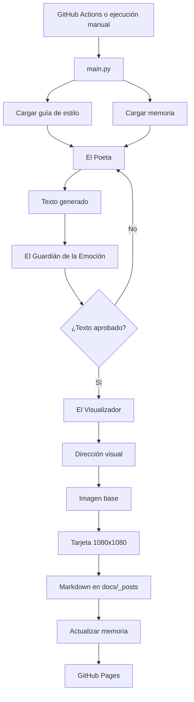

# Ecos del Alma

Escritos breves, imágenes editoriales y publicación web automática.


## Demo

- **Web:** https://faridSprado.github.io/ecos-del-alma/
- **Repositorio:** https://github.com/faridSprado/ecos-del-alma.git

## Sobre el proyecto

**Ecos del Alma** es un cuaderno digital de textos breves sobre memoria, vínculos, despedidas y regreso a uno mismo.

La idea fue construir un flujo propio para escribir, revisar, acompañar visualmente y publicar cada pieza sin repetir el proceso manualmente desde cero.

El resultado combina escritura, criterio editorial, composición visual, automatización y publicación web.

## Qué hace

Cada ejecución sigue este flujo:

1. Carga una guía de estilo propia.
2. Revisa los temas usados recientemente.
3. Elige un nuevo tema.
4. Escribe una pieza breve.
5. Revisa si el texto tiene tono, claridad y evita frases demasiado genéricas.
6. Si no pasa la revisión, vuelve a intentarlo.
7. Crea una dirección visual.
8. Compone una tarjeta cuadrada de 1080x1080 px.
9. Publica el texto en `docs/_posts/`.
10. Actualiza la memoria del proyecto.

## Módulos principales

### El Poeta

Genera el texto principal a partir del tema seleccionado y de la guía de estilo.

### El Guardián de la Emoción

Revisa el texto antes de publicarlo. Evalúa si suena natural, si usa imágenes concretas y si evita frases demasiado planas.

### El Visualizador

Crea una dirección visual para la pieza. Después, el proyecto compone una tarjeta cuadrada lista para la web o redes.

## Arquitectura



## Estructura

```text
ecos-del-alma/
├── .github/
│   └── workflows/
│       └── daily-escrito.yml
├── agentes/
│   └── agentes.py
├── biblia/
│   └── guia_estilo.json
├── docs/
│   ├── _config.yml
│   ├── index.md
│   ├── proceso.md
│   ├── _layouts/
│   │   ├── default.html
│   │   └── post.html
│   ├── _posts/
│   └── assets/
│       ├── css/
│       │   └── style.css
│       └── social/
├── memoria/
│   ├── estado_publicacion.json
│   └── temas_usados.json
├── utils/
│   ├── render_social.py
│   └── rebuild_cards.py
├── config.py
├── main.py
├── requirements.txt
├── .env.example
├── .gitignore
└── README.md
```

## Guía de estilo

La base creativa está en:

```text
biblia/guia_estilo.json
```

Ahí se define:

- tono general;
- temas disponibles;
- longitud esperada;
- recursos literarios permitidos;
- frases o estilos que se deben evitar;
- estructura sugerida para cada escrito.

Algunos temas incluidos:

- Amor consciente
- Despedidas y duelos
- Soledad fértil
- Esperanza realista
- Vínculos humanos
- Cicatrices
- Volver a mí
- Lo que no dije

## Tecnologías

- **Python 3.11+** para orquestar el flujo.
- **Groq API** para generación y revisión de texto.
- **Llama 3.3 70B Versatile** como modelo principal.
- **Pollinations.ai** para crear una imagen base.
- **Pillow** para componer tarjetas visuales de 1080x1080 px.
- **Markdown + Jekyll** para publicar los escritos.
- **GitHub Pages** para alojar la web.
- **GitHub Actions** para automatizar la ejecución.
- **JSON** para configuración y memoria.

## Instalación local

### 1. Clonar el repositorio

```bash
git clone https://github.com/faridSprado/ecos-del-alma.git
cd ecos-del-alma
```

### 2. Crear entorno virtual

En Windows PowerShell:

```bash
python -m venv venv
.\venv\Scripts\Activate.ps1
```

Si PowerShell bloquea la activación:

```bash
Set-ExecutionPolicy -ExecutionPolicy RemoteSigned -Scope CurrentUser
.\venv\Scripts\Activate.ps1
```

### 3. Instalar dependencias

```bash
python -m pip install -r requirements.txt
```

### 4. Configurar variables de entorno

Copia el archivo de ejemplo:

```bash
copy .env.example .env
```

Dentro de `.env`, agrega tu clave de Groq:

```env
GROQ_API_KEY=gsk_tu_clave_de_groq
GROQ_MODEL=llama-3.3-70b-versatile
PROJECT_TIMEZONE=America/Bogota
MAX_INTENTOS=3
TEMAS_RECIENTES_A_EVITAR=3
```

El archivo `.env` no se sube a GitHub.

### 5. Ejecutar

```bash
python main.py
```

Si todo está bien, se creará una nueva publicación en:

```text
docs/_posts/
```

Y una tarjeta visual en:

```text
docs/assets/social/
```

## Reconstruir tarjetas existentes

Si cambias el diseño visual y quieres actualizar las imágenes de publicaciones anteriores:

```bash
python utils/rebuild_cards.py
```

Este comando vuelve a crear las tarjetas en `docs/assets/social/` y actualiza el campo `image` de cada publicación.

## Automatización

El workflow está en:

```text
.github/workflows/daily-escrito.yml
```

Se puede ejecutar manualmente desde la pestaña **Actions** de GitHub o dejarlo programado para correr una vez al día.

Para que funcione en GitHub Actions, el repositorio necesita un secret llamado:

```text
GROQ_API_KEY
```

Ruta en GitHub:

```text
Settings → Secrets and variables → Actions → New repository secret
```

## GitHub Pages

La web se publica desde la carpeta `docs/`.

Configuración recomendada:

```text
Settings → Pages
Source: Deploy from a branch
Branch: main
Folder: /docs
```

## Por qué está hecho así

El valor del proyecto está en el flujo completo:

- una guía de estilo editable;
- módulos separados para escribir, revisar y visualizar;
- memoria para no repetir temas;
- publicación web automática;
- creación de piezas visuales reutilizables.

La intención es tener una herramienta propia, dirigida por reglas claras y con una estética consistente.

## Posibles siguientes mejoras

- Publicación automática en Instagram o Threads.
- Variantes verticales para stories.
- Dashboard con métricas de temas y publicaciones.
- Selector de líneas editoriales.
- Modo oscuro.
- Feed RSS.

## Autor

**Farid Prado**

Proyecto personal de escritura, automatización creativa y publicación web.
